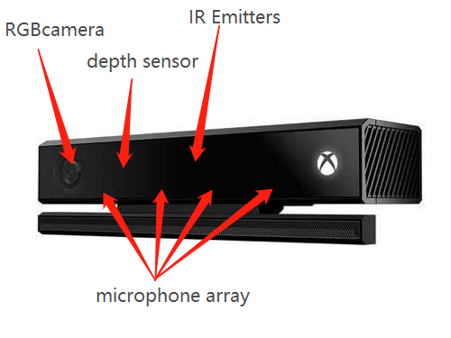

# The using guide for Kinect Data Acquisition

---

written by asakuras

###What is Kinect V2
Kinect V2 is the second generation of somatosensory equipment created for Xbox gamers released by Microsoft. Because of its various cameras and the high-definition pixel, we can use it to gather information we need such as colorFrame, depthFrame, bodyIndexFrame, facePointFrame and so on.

* RGB camera: this camera is used to gather the color images
* IR Emitter: it will emit infrared rays
* depth sensor: receive the infrared rays and create the depth images in return
* microphone array: four microphones used to record audio source(not used in this solution)

| DataSource        | Resolution ratio|Fps |
|-------------------|:---------------:|---:|
|ColorFrameSource   |1920*1080        | 30 |
|InfraredFrameSource|512*424          | 30 |
|DepthFrameSource   |512*424          | 30 |
### How to use:

#### Environment:

 * [visual studio community 2017](https://visualstudio.microsoft.com/thank-you-downloading-visual-studio/?sku=Community&rel=15)

 * [Microsoft Kinect V2 SDK](https://www.microsoft.com/en-us/download/confirmation.aspx?id=44561)

Before run the project, you should add reference first:
* Microsoft.Kinect
* Microsoft.Kinect.Face
* System.Drawing

#### Brief code explanation

The solution is written in C# by the visual studio community 2017, whose name is  `Kinect Data Acquisition`, including two projects:`Kinect Data Acquisition` and `Binary Extractor`.

`Kinect Data Acquisition` is running in the x64 Arch
`Binary Extractor` is running in the x32 Arch

 * `Kinect Data Acquisition` is used to gathering the video source and stored it in a thread-safe queue, in the meanwhile the queue pop the frame and save it to the local as a binary file(if you store it directly when you are capture the video source, it will be quite slow and usually lead to unpredictable problems)

* `Binary Extractor` is used to extract the binary file to the color image, depth image, depthCSV, and facePoint CSV.

 

 